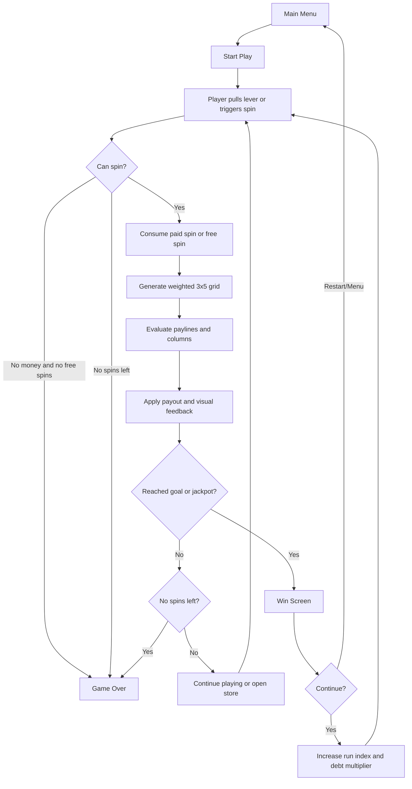
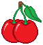
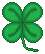
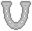
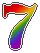
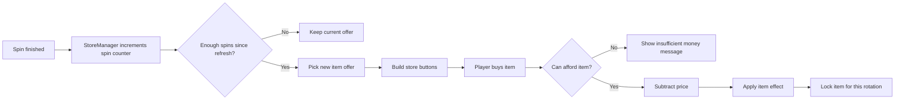
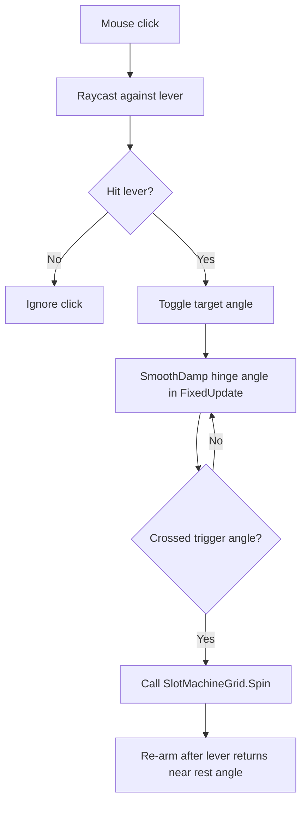
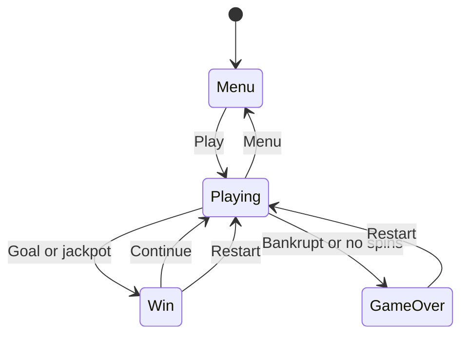
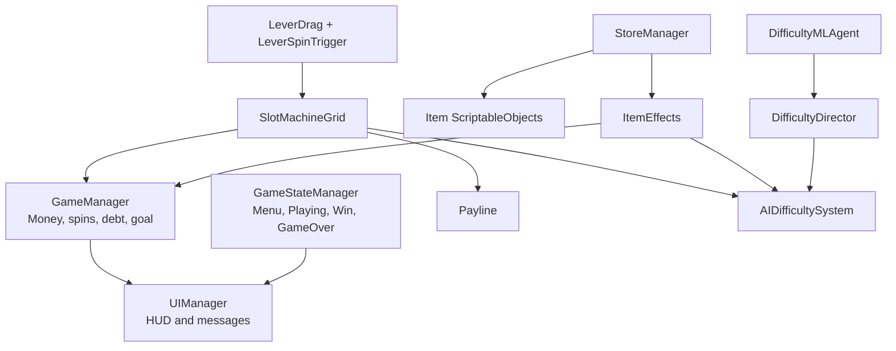

# Clover Pit

Final Unity project by **Gonzalo Garcia** and **Diego Esteve Seivane**.

`Clover Pit` is a casino-style slot machine game built in Unity. The player starts with a fixed amount of money, spends money to spin a 3x5 slot grid, wins payouts through symbol combinations, buys upgrades in a rotating store, and tries to reach the required money goal before running out of spins or going bankrupt.

The project combines several systems:

- A slot machine with weighted random symbols.
- Row, diagonal, and column payout evaluation.
- A run-based economy with spin costs, limited attempts, goals, and debt scaling.
- A rotating item shop with temporary and permanent effects.
- Adaptive difficulty and luck logic.
- A physical lever interaction using Unity physics.
- Menu, HUD, win, and game-over states.

## Project Info

| Field | Value |
| --- | --- |
| Project | Clover Pit |
| Engine | Unity `6000.2.6f2` |
| Main scene | `Assets/Scenes/MainScene.unity` |
| Main language | C# |
| Render pipeline | Universal Render Pipeline |
| Input | Unity Input System plus mouse-based lever interaction |
| Participants | Gonzalo Garcia, Diego Esteve Seivane |

## Game Concept

The game takes the visual language of a slot machine and turns it into a progression challenge. Instead of spinning forever, the player is constrained by money, spin count, and target goals. Each run asks the player to make a simple but meaningful decision: spend money on another spin, use free spins if available, or buy store items that improve future odds.

The goal is to reach the current money objective. If the player reaches the goal or hits a high payout, the game enters a win state and allows the player to continue. Continuing increases the challenge by raising the debt multiplier, increasing spin costs, and expanding the next run target.

## Core Loop



## Visual Symbols

The main slot symbols are ScriptableObject assets under `Assets/ScriptableObjects/Symbols`. Each symbol stores its sprite, spawn weight, and payouts for 3, 4, or 5 matching symbols.

| Symbol | Asset | Weight | Pay 3 | Pay 4 | Pay 5 |
| --- | --- | ---: | ---: | ---: | ---: |
|  | Cherry | 30 | 10 | 25 | 80 |
|  | Clover | 20 | 15 | 40 | 120 |
|  | Horseshoe | 10 | 20 | 60 | 180 |
|  | Seven | 8 | 30 | 80 | 300 |

The lower the weight, the rarer the symbol. Rarer symbols have higher payouts.

## Slot Machine Logic

The slot machine is controlled mainly by `SlotMachineGrid`.

### Grid Layout

The machine uses a fixed **3 rows x 5 columns** grid:

```text
Column:   0      1      2      3      4
        +------+------+------+------+------+
Row 0   |      |      |      |      |      |
        +------+------+------+------+------+
Row 1   |      |      |      |      |      |
        +------+------+------+------+------+
Row 2   |      |      |      |      |      |
        +------+------+------+------+------+
```

Each UI cell has a `GridCellIndex` component that identifies its `row` and `col`. During startup, `SlotMachineGrid.BuildCellsMap()` scans the child UI images and builds a two-dimensional `Image[,]` lookup. If the scene does not contain exactly 15 valid indexed cells, the script logs errors to help debug the grid setup.

### Spin Generation

When a spin starts:

1. The game checks that the player is in the `Playing` state.
2. It blocks a new spin if the machine is already spinning.
3. It checks game-over conditions, including no spins left, no money, and no free spins.
4. It consumes either a free spin or a paid spin.
5. It subtracts the current spin cost when the spin is paid.
6. It generates the final result using weighted random selection.
7. It animates random temporary symbols before showing the final result.

Symbol probability is based on:

- The symbol's base `weight`.
- The current `playerLuck` value from `AIDifficultySystem`.
- Any accumulated symbol-specific bonus stored in `GameManager`.

The effective weight is calculated conceptually like this:

```text
effectiveWeight = symbol.weight * (1 + playerLuck + symbolBonus)
```

The result is clamped so every symbol always has at least a small chance to appear.

## Paylines

Payline definitions live in `Payline.cs`. The game evaluates rows, diagonals, and vertical columns.

### Row Lines

```text
Top:     X X X X X
Middle:  X X X X X
Bottom:  X X X X X
```

Rows have a multiplier of `1.0`.

### Diagonal Lines

```text
Diagonal V:
X . . . X
. X . X .
. . X . .

Inverted V:
. . X . .
. X . X .
X . . . X
```

Diagonals have a multiplier of `1.2`, so diagonal wins are slightly more valuable than normal row wins.

### Column Wins

The game also checks each of the five vertical columns. If all three symbols in a column match, the player receives that symbol's `pay3` value.

```text
Column win example:
. X . . .
. X . . .
. X . . .
```

## Payout Evaluation

`SlotMachineGrid.EvaluatePayout()` is responsible for calculating winnings.

For each row or diagonal line:

1. The script checks matching runs from columns `0`, `1`, and `2`.
2. A run must contain at least 3 matching symbols.
3. A 3-symbol, 4-symbol, or 5-symbol match uses `pay3`, `pay4`, or `pay5`.
4. The line multiplier is applied.
5. Only the best payout for that line is counted.
6. Winning cells are stored so they can be highlighted.

After row and diagonal evaluation, the script checks all five columns for 3-symbol vertical matches.

When a payout is found:

- Winning groups pulse visually.
- The result popup displays the payout.
- Win particles can play.
- Money is added to the player.
- The adaptive difficulty system is notified whether the spin was a win or loss.

## Economy and Run Rules

The main economy is handled by `GameManager`.

### Starting Values

| Setting | Current Purpose |
| --- | --- |
| `startingMoney` | Initial bankroll at the start of the game. |
| `spinsPerLevel` | Base number of paid spins available in a run. |
| `baseSpinCost` | Base cost of one paid spin. |
| `debtMultiplierStep` | Multiplies the debt level after continuing from a win. |
| `baseGoalMoney` | Base target money value for a run. |
| `spinsIncreasePerContinue` | Adds more spins after each continue. |
| `goalIncreasePerContinue` | Raises the target goal after each continue. |

### Spin Cost

```text
currentSpinCost = baseSpinCost * debtMultiplier
```

Free spins do not reduce the paid spin counter and do not subtract money. Paid spins reduce `SpinsLeft` and subtract the current spin cost.

### Win and Continue Progression

If the player reaches the current money goal or earns a jackpot-sized payout, the game switches to the win screen. Continuing after a win calls `ApplyWinContinue()`:

```text
runIndex += 1
debtMultiplier *= debtMultiplierStep
spinsLeft = spinsPerLevel + runIndex * spinsIncreasePerContinue
goal = baseGoalMoney + progression increase
```

This creates a push-your-luck structure: the player can stop after winning or continue into a harder round with higher costs and a higher target.

## Store System

The store is controlled by `StoreManager`, `StoreItemButton`, `Item`, and `ItemEffects`.

### Store Flow



The store shows a limited number of items from the available item pool. It refreshes after a configured number of spins and tries to avoid repeating the previous offer when possible.

### Current Item Assets

Item data is stored as ScriptableObjects in `Assets/ScriptableObjects/Items`.

| Item | Price | Main effect |
| --- | ---: | --- |
| Cherry Booster | 100 | Increases cherry appearance chance. |
| Clover Booster | 150 | Increases clover appearance chance. |
| Horseshoe Booster | 200 | Increases horseshoe appearance chance. |
| Seven Booster | 250 | Increases seven appearance chance. |
| Free Spin Token | 60 | Adds 3 free spins. |
| Golden Horseshoe | 75 | Temporarily reduces difficulty. |
| Lucky Clover | 50 | Temporarily increases player luck. |
| Rainbow Multiplier | 100 | Temporarily doubles wins. |
| Win Charm | 0 | Sets up a guaranteed-win effect flag. |
| Upgrade3-row | 100 | Intended to improve 3-symbol payout value. |
| Upgrade4-row | 250 | Intended to improve 4-symbol payout value. |
| Upgrade5-row | 600 | Intended to improve 5-symbol payout value. |

### Item Effect Types

The effect system supports:

- `IncreaseLuck`: temporarily raises `AIDifficultySystem.playerLuck`.
- `ReduceDifficulty`: temporarily lowers `AIDifficultySystem.difficulty`.
- `DoubleWins`: doubles positive money gains for a number of spins.
- `FreeSpins`: immediately adds free spins.
- `GuaranteedWin`: marks the next spin as guaranteed through a game flag.
- `UpgradePay3`, `UpgradePay4`, `UpgradePay5`: increases payout multipliers stored in `GameManager`.
- `IncreaseSymbolBaseChance`: permanently adds a symbol-specific probability bonus.

Temporary item effects wait for completed spins rather than real-time seconds. This makes item duration easier for the player to understand: an effect that lasts 5 spins lasts exactly 5 resolved spins.

## Adaptive Difficulty

The adaptive difficulty system is split across three scripts:

- `AIDifficultySystem`
- `DifficultyDirector`
- `DifficultyMLAgent`

### AIDifficultySystem

`AIDifficultySystem` stores the current difficulty values:

| Value | Meaning |
| --- | --- |
| `baseWinChance` | Base chance used by command-style forced result logic. |
| `difficulty` | General difficulty from `0.0` to `1.0`. |
| `playerLuck` | Luck modifier from `-0.5` to `0.5`. |
| `debtMultiplier` | Difficulty-side cost tuning multiplier. |
| `payoutMultiplier` | Difficulty-side payout tuning multiplier. |
| `lossProtectionEnabled` | Optional protection to cap losses. |

After each evaluated spin, the system adjusts:

```text
If the player wins:
    difficulty increases slightly
    playerLuck decreases slightly

If the player loses:
    difficulty decreases slightly
    playerLuck increases slightly
```

This creates a balancing loop where repeated losses make the game more forgiving, while repeated wins make it more demanding.

### DifficultyDirector

`DifficultyDirector` observes the session and prepares data for adaptive decisions:

- Current bankroll.
- Win streak.
- Loss streak.
- Session time.
- Free spins.
- Recent payout average.
- Current difficulty.
- Current luck.

It also computes a reward signal that prefers keeping the player in a playable range: not bankrupt, not exploding too far above the target economy, and not receiving huge unstable payouts too often.

### DifficultyMLAgent

`DifficultyMLAgent` is an ML-Agents integration point. It collects observations from `DifficultyDirector` and can output discrete actions such as:

- Increase, decrease, or keep difficulty.
- Increase, decrease, or keep luck.
- Tune debt pressure.
- Tune payout pressure.
- Request item-like assistance.
- Enable or disable loss protection.

The heuristic mode keeps all controls neutral, which is useful when running the game without a trained model.

## Lever Interaction

The lever is implemented as a physical interaction rather than a simple UI button.

| Script | Role |
| --- | --- |
| `LeverDrag` | Handles mouse raycast selection and smooth hinge rotation. |
| `LeverSpinTrigger` | Detects when the lever crosses the trigger angle and starts a spin. |
| `LeverVisibilityGuard` | Keeps lever visibility consistent with game state. |

The lever flow:



The lever uses a `Rigidbody` and `HingeJoint`, then applies controlled rotation with `MoveRotation`. This gives the interaction a physical feel while still keeping it stable enough for gameplay.

## Game States and UI

The state flow is handled by `GameStateManager`.



### State Responsibilities

| State | Visible UI | Purpose |
| --- | --- | --- |
| `Menu` | Menu panel | Entry point before playing. |
| `Playing` | HUD panel | Active slot machine gameplay. |
| `Win` | End panel with continue | Player reached the goal or jackpot condition. |
| `GameOver` | End panel without continue | Player lost by bankruptcy, no spins, or general loss. |

`UIManager` updates money, free spins, round information, temporary messages, and result popups.

## Script Architecture



## Folder Structure

```text
Clover-pit/
|-- Assets/
|   |-- Scenes/
|   |   `-- MainScene.unity
|   |-- Scripts/
|   |   |-- AI/
|   |   |-- CallSystem/
|   |   |-- GameManager/
|   |   |-- GameState/
|   |   |-- Lever/
|   |   |-- Parallax/
|   |   |-- SlotMachine/
|   |   `-- Store/
|   |-- ScriptableObjects/
|   |   |-- Items/
|   |   `-- Symbols/
|   |-- Prefabs/
|   |-- Sprites/
|   |-- Materials/
|   |-- Audio/
|   |-- TextMesh Pro/
|   |-- VRInteractions/
|   `-- Settings/
|-- Packages/
|-- ProjectSettings/
|-- .gitignore
|-- .gitattributes
`-- README.md
```

### Important Folders

| Folder | Description |
| --- | --- |
| `Assets/Scenes` | Contains the playable scene. |
| `Assets/Scripts/AI` | Adaptive difficulty, director logic, and ML-Agents hook. |
| `Assets/Scripts/CallSystem` | Command pattern helpers for forcing or tuning outcomes. |
| `Assets/Scripts/GameManager` | Money, run values, free spins, and UI manager. |
| `Assets/Scripts/GameState` | Menu, play, win, and game-over transitions. |
| `Assets/Scripts/Lever` | Physical lever input and spin trigger. |
| `Assets/Scripts/Parallax` | Background movement helpers. |
| `Assets/Scripts/SlotMachine` | Grid, symbols, paylines, and payout calculation. |
| `Assets/Scripts/Store` | Store rotation, item buttons, item definitions, and item effects. |
| `Assets/ScriptableObjects/Items` | Data-driven shop items. |
| `Assets/ScriptableObjects/Symbols` | Data-driven slot symbols and payout values. |
| `Packages` | Unity package manifest and lock file. |
| `ProjectSettings` | Unity settings required to open the project correctly. |

## Main Scripts

| Script | Responsibility |
| --- | --- |
| `GameManager.cs` | Central economy, money, free spins, spin cost, debt multiplier, goals, and run reset/continue logic. |
| `GameStateManager.cs` | Controls menu, gameplay, win, and game-over UI panels. |
| `UIManager.cs` | Updates HUD text, messages, and payout popups. |
| `SlotMachineGrid.cs` | Runs spins, generates weighted results, evaluates payouts, plays win feedback, and triggers state changes. |
| `Payline.cs` | Defines rows, diagonals, column checks, and line multipliers. |
| `Symbol.cs` | ScriptableObject data for symbol ID, sprite, weight, and payouts. |
| `Item.cs` | ScriptableObject data for shop item name, description, price, icon, and effect. |
| `StoreManager.cs` | Rotates store offers, builds item buttons, processes purchases, and refreshes UI. |
| `StoreItemButton.cs` | Displays an item and blocks purchase when locked or unaffordable. |
| `ItemEffects.cs` | Applies temporary and permanent effects to luck, difficulty, payouts, free spins, and symbol probabilities. |
| `AIDifficultySystem.cs` | Stores and updates adaptive difficulty, luck, payout, and loss-protection values. |
| `DifficultyDirector.cs` | Tracks session observations and computes reward information for AI decisions. |
| `DifficultyMLAgent.cs` | ML-Agents bridge for observations and discrete difficulty actions. |
| `LeverDrag.cs` | Handles lever click detection and smooth hinge motion. |
| `LeverSpinTrigger.cs` | Starts a spin when the lever crosses the trigger angle. |
| `ParallaxLayer.cs` | Moves background layers relative to camera movement. |

## Command System

The `CallSystem` folder uses a simple command interface:

```csharp
public interface ICallCommand
{
    string Name { get; }
    void Execute();
}
```

Implemented commands include:

- `BoostPayoutCommand`: increases luck and reduces difficulty.
- `ForceWinCommand`: forces the next AI result to win.
- `ForceLossCommand`: forces the next AI result to lose.
- `SlowDifficultyCommand`: reduces luck and increases difficulty.

This keeps difficulty/debug actions encapsulated as small reusable command objects.

## How to Open the Project

1. Clone the repository.
2. Open Unity Hub.
3. Choose **Add project from disk**.
4. Select the repository folder.
5. Open it with Unity `6000.2.6f2`.
6. Open `Assets/Scenes/MainScene.unity`.

Unity will regenerate ignored folders such as `Library`, `Temp`, `obj`, `Logs`, and `UserSettings`.

## Git Notes

The repository intentionally tracks Unity source files and project configuration, but ignores generated local files.

Tracked:

- `Assets`
- `Packages`
- `ProjectSettings`
- `README.md`
- `.gitignore`
- `.gitattributes`

Ignored:

- `Library`
- `Temp`
- `obj`
- `Logs`
- `UserSettings`
- IDE-generated project files such as `.csproj` and `.sln`
- Local editor folders such as `.vs`, `.vscode`, and `.idea`

## Summary

`Clover Pit` is more than a simple random slot machine. It is built around a complete gameplay loop: limited resources, weighted outcomes, escalating debt, dynamic store upgrades, adaptive difficulty, and physical input through a lever. The project structure separates gameplay systems into clear folders so the slot logic, economy, UI, item system, and difficulty systems can be understood and extended independently.
